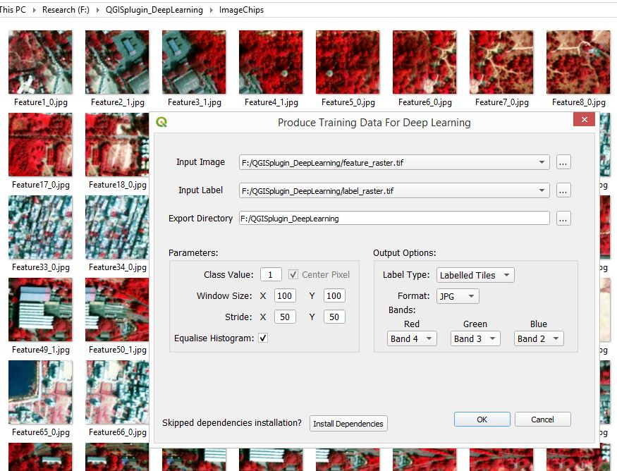

# QGIS-Plugin-Produce-Training-Samples-For-Deep-Learning
Deep learning has achieved unprecedented accuracy in a variety of fields, including remote sensing. But not every remote sensing professional has a strong programming background, which is the required skill for practising deep learning. While enough material and sample code for deep learning applications are available in online repositories, pre-processing the remote sensing datasets to reach the training stage is still a tedious task and requires programming knowledge. Proprietary options to pre-process the data only on mouse clicks are available. However, access to such licensed software is often expensive and hence limited for a large population of researchers and practitioners. The plugin bridges the gap by enabling users to generate training samples in the form of image chips for deep learning application.

**Available combinations in the plugin:** 
 * Generate image chips of any window size and stride in TIFF and JPG format. 
 * When stride is equal to or greater than the window size, the overlap is zero. When the stride is half of the window size, overlap is 50 per cent and so on. 
 * When output format is TIFF, all the bands will be exported. Equalise Histogram option will be disabled. 
 * When output format is JPG, three bands should be specified for export. Equalise Histogram option will be enabled. 
 * If class value is null and center pixel is unchecked, all the non-zero values will be converted to 1 and will be considered as the label value. Label type can either be labelled tiles or mask pairs. 
 * If class value is null and center pixel is checked, all the non-zero values will be converted to 1 and will be considered as the label value. Label type can can only be labelled tiles. 
 * If class value is an integer or float, it will be converted to integer to be considered as label. The center pixel option will be disabled in this case. Label type can either be labelled tiles or mask pairs. 

**Mandatory:** 
 * Input Image (Multispectral raster, at least three bands) 
 * Input Label (classified raster, single band) 
 * Export Directory (where the image chips folder will be created) 

Feel free to report bugs and get support. Suggestions for additional features are most welcomed. 
Email: pratkrt@gmail.com
